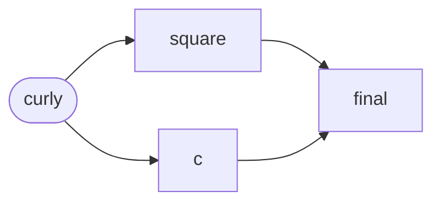

---
tags:
    - C++
    - tutorial
---

# Code example

Тестирую на что способен MkDocs, подсветка и всё такое.

Блок кода с подсветкой:

```C++ title="helloworld.cpp"
#include <iostream>

void funcname(int param1) {
    std::cout << "Hello world\n";
}

int main() {
    funcname();
    return 0;
}
```

Схемочка на mermaid:



